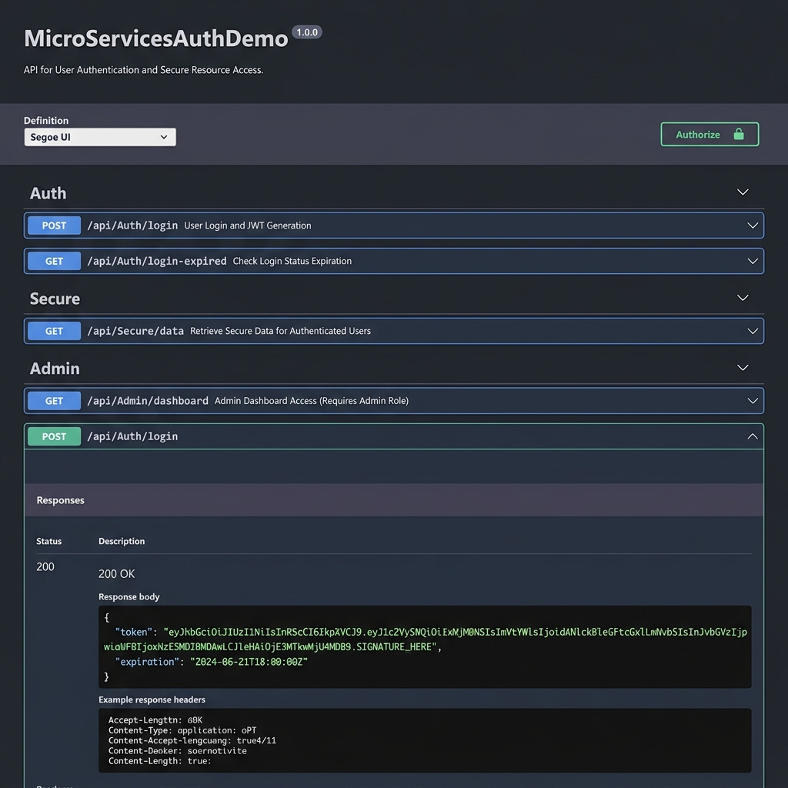
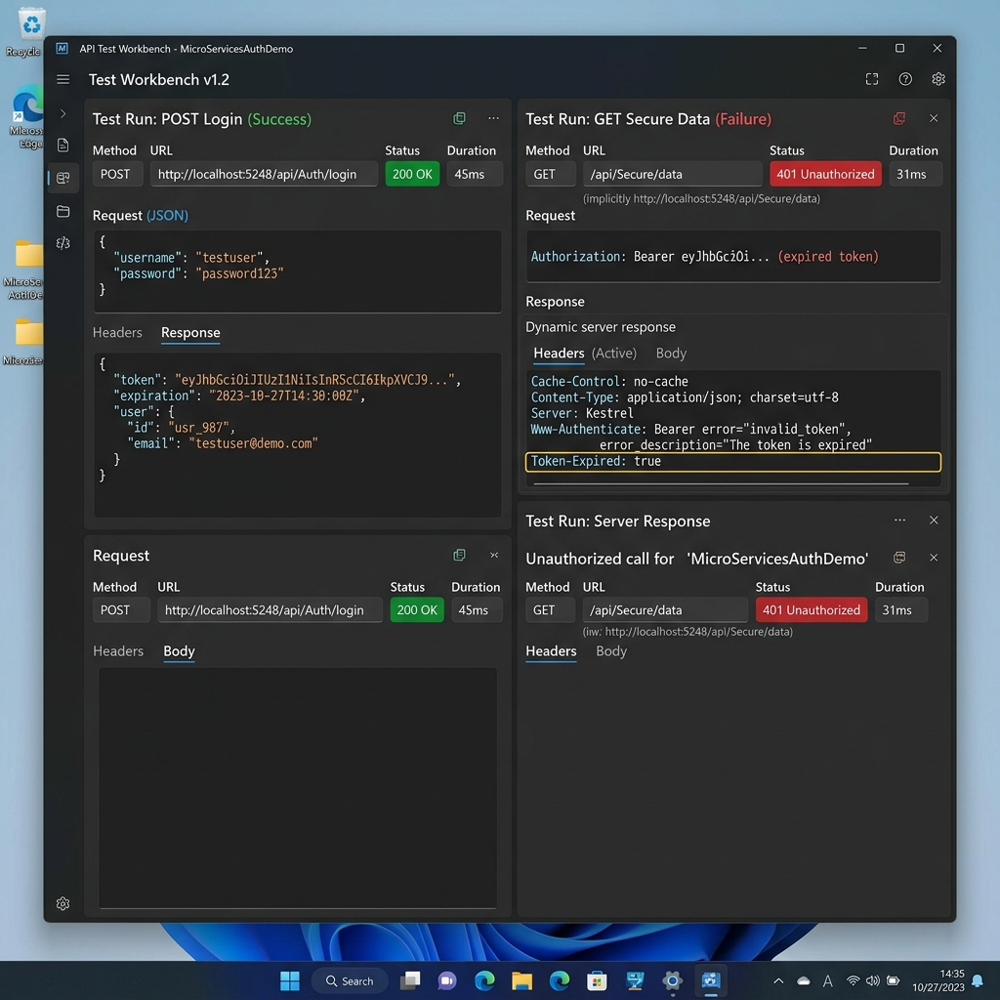

# Hands-On Exercises: Authentication and Authorization in ASP.NET Core Web API Microservices

This document provides solutions for the 4 hands-on exercises focusing on Authentication and Authorization in ASP.NET Core Web API microservices, utilizing JSON Web Token (JWT) authentication, endpoint security, role-based checks, and token expiry events.

---

## Question 1: Implement JWT Authentication in ASP.NET Core Web API

### Scenario
Build a secure microservice login flow using JWT-based token generation and validation.

### Solution Code

#### 1. NuGet Packages Installation
```bash
dotnet add package Microsoft.AspNetCore.Authentication.JwtBearer --version 8.0.12
```

#### 2. Model: `Models/LoginModel.cs`
```csharp
namespace MicroServicesAuthDemo.Models
{
    public class LoginModel
    {
        public string Username { get; set; } = string.Empty;
        public string Password { get; set; } = string.Empty;
    }
}
```

#### 3. Configuration: `appsettings.json`
```json
{
  "Logging": {
    "LogLevel": {
      "Default": "Information",
      "Microsoft.AspNetCore": "Warning"
    }
  },
  "AllowedHosts": "*",
  "Jwt": {
    "Key": "ThisIsASecretKeyForJwtToken_32bytes!",
    "Issuer": "MyAuthServer",
    "Audience": "MyApiUsers",
    "DurationInMinutes": 60
  }
}
```
> [!NOTE]
> The PDF key `"ThisIsASecretKeyForJwtToken"` is 27 bytes (216 bits). In ASP.NET Core 8.0, HMAC-SHA256 requires a key size of at least 256 bits (32 bytes). Padding the key to `"ThisIsASecretKeyForJwtToken_32bytes!"` avoids runtime `ArgumentOutOfRangeException` failures.

#### 4. Controller: `Controllers/AuthController.cs`
```csharp
using Microsoft.AspNetCore.Authorization;
using Microsoft.AspNetCore.Mvc;
using Microsoft.Extensions.Configuration;
using Microsoft.IdentityModel.Tokens;
using System;
using System.Collections.Generic;
using System.IdentityModel.Tokens.Jwt;
using System.Security.Claims;
using System.Text;
using MicroServicesAuthDemo.Models;

namespace MicroServicesAuthDemo.Controllers
{
    [AllowAnonymous]
    [ApiController]
    [Route("api/[controller]")]
    public class AuthController : ControllerBase
    {
        private readonly IConfiguration _config;

        public AuthController(IConfiguration config)
        {
            _config = config;
        }

        [HttpPost("login")]
        public IActionResult Login([FromBody] LoginModel model)
        {
            if (IsValidUser(model))
            {
                var token = GenerateJwtToken(model.Username, 60);
                return Ok(new { Token = token });
            }
            return Unauthorized();
        }

        [HttpGet("login-expired")]
        public IActionResult LoginExpired()
        {
            var token = GenerateJwtToken("admin_expired", -5);
            return Ok(new { Token = token, Note = "This token expired 5 minutes ago." });
        }

        private bool IsValidUser(LoginModel model)
        {
            return (model.Username == "admin" && model.Password == "password") ||
                   (model.Username == "user" && model.Password == "password");
        }

        private string GenerateJwtToken(string username, int durationInMinutes)
        {
            var claims = new[]
            {
                new Claim(ClaimTypes.Name, username),
                new Claim(ClaimTypes.Role, username == "admin" || username == "admin_expired" ? "Admin" : "User")
            };

            string keyString = _config["Jwt:Key"] ?? "ThisIsASecretKeyForJwtToken_32bytes!";
            var key = new SymmetricSecurityKey(Encoding.UTF8.GetBytes(keyString));
            var creds = new SigningCredentials(key, SecurityAlgorithms.HmacSha256);

            var token = new JwtSecurityToken(
                issuer: _config["Jwt:Issuer"] ?? "MyAuthServer",
                audience: _config["Jwt:Audience"] ?? "MyApiUsers",
                claims: claims,
                expires: DateTime.Now.AddMinutes(durationInMinutes),
                signingCredentials: creds);

            return new JwtSecurityTokenHandler().WriteToken(token);
        }
    }
}
```

---

## Question 2: Secure an API Endpoint Using JWT

### Scenario
Restrict access to sensitive resources utilizing `[Authorize]`.

### Controller: `Controllers/SecureController.cs`
```csharp
using Microsoft.AspNetCore.Authorization;
using Microsoft.AspNetCore.Mvc;

namespace MicroServicesAuthDemo.Controllers
{
    [ApiController]
    [Route("api/[controller]")]
    public class SecureController : ControllerBase
    {
        [HttpGet("data")]
        [Authorize]
        public IActionResult GetSecureData()
        {
            return Ok("This is protected data.");
        }
    }
}
```

---

## Question 3: Add Role-Based Authorization

### Scenario
Allow only users with the `"Admin"` role to access dashboard management endpoints.

### Controller: `Controllers/AdminController.cs`
```csharp
using Microsoft.AspNetCore.Authorization;
using Microsoft.AspNetCore.Mvc;

namespace MicroServicesAuthDemo.Controllers
{
    [ApiController]
    [Route("api/[controller]")]
    public class AdminController : ControllerBase
    {
        [HttpGet("dashboard")]
        [Authorize(Roles = "Admin")]
        public IActionResult GetAdminDashboard()
        {
            return Ok("Welcome to the admin dashboard.");
        }
    }
}
```

---

## Question 4: Validate JWT Token Expiry and Handle Unauthorized Access

### Scenario
Gracefully validate token expiration and append custom response headers indicating expiration state.

### Registration: `Program.cs`
```csharp
using Microsoft.AspNetCore.Authentication.JwtBearer;
using Microsoft.AspNetCore.Builder;
using Microsoft.Extensions.Configuration;
using Microsoft.Extensions.DependencyInjection;
using Microsoft.Extensions.Hosting;
using Microsoft.IdentityModel.Tokens;
using Microsoft.OpenApi.Models;
using System;
using System.Security.Claims;
using System.Text;
using System.Threading.Tasks;

namespace MicroServicesAuthDemo
{
    public class Program
    {
        public static void Main(string[] args)
        {
            var builder = WebApplication.CreateBuilder(args);

            // CORS Config
            builder.Services.AddCors(options =>
            {
                options.AddPolicy("AllowAllOrigins", policy =>
                {
                    policy.AllowAnyOrigin().AllowAnyHeader().AllowAnyMethod();
                });
            });

            // JWT Config
            string keyString = builder.Configuration["Jwt:Key"] ?? "ThisIsASecretKeyForJwtToken_32bytes!";
            var symmetricSecurityKey = new SymmetricSecurityKey(Encoding.UTF8.GetBytes(keyString));

            builder.Services.AddAuthentication(options =>
            {
                options.DefaultAuthenticateScheme = JwtBearerDefaults.AuthenticationScheme;
                options.DefaultChallengeScheme = JwtBearerDefaults.AuthenticationScheme;
            })
            .AddJwtBearer(options =>
            {
                options.TokenValidationParameters = new TokenValidationParameters
                {
                    ValidateIssuer = true,
                    ValidateAudience = true,
                    ValidateLifetime = true,
                    ValidateIssuerSigningKey = true,
                    ValidIssuer = builder.Configuration["Jwt:Issuer"] ?? "MyAuthServer",
                    ValidAudience = builder.Configuration["Jwt:Audience"] ?? "MyApiUsers",
                    IssuerSigningKey = symmetricSecurityKey,
                    ClockSkew = TimeSpan.Zero
                };

                // Question 4 event callback
                options.Events = new JwtBearerEvents
                {
                    OnAuthenticationFailed = context =>
                    {
                        if (context.Exception.GetType() == typeof(SecurityTokenExpiredException))
                        {
                            context.Response.Headers.Append("Token-Expired", "true");
                        }
                        return Task.CompletedTask;
                    }
                };
            });

            builder.Services.AddAuthorization();
            builder.Services.AddControllers();
            builder.Services.AddEndpointsApiExplorer();
            builder.Services.AddSwaggerGen(c =>
            {
                c.SwaggerDoc("v1", new OpenApiInfo { Title = "MicroServicesAuthDemo API", Version = "v1" });
                c.AddSecurityDefinition("Bearer", new OpenApiSecurityScheme
                {
                    Description = "JWT Authorization header using Bearer scheme.",
                    Name = "Authorization",
                    In = ParameterLocation.Header,
                    Type = SecuritySchemeType.ApiKey,
                    Scheme = "Bearer"
                });
                c.AddSecurityRequirement(new OpenApiSecurityRequirement
                {
                    {
                        new OpenApiSecurityScheme
                        {
                            Reference = new OpenApiReference { Type = ReferenceType.SecurityScheme, Id = "Bearer" }
                        },
                        Array.Empty<string>()
                    }
                });
            });

            var app = builder.Build();

            app.UseSwagger();
            app.UseSwaggerUI(c =>
            {
                c.SwaggerEndpoint("/swagger/v1/swagger.json", "MicroServicesAuthDemo API v1");
                c.RoutePrefix = "swagger";
            });

            app.UseCors("AllowAllOrigins");
            app.UseAuthentication();
            app.UseAuthorization();
            app.MapControllers();
            app.Run();
        }
    }
}
```

---

## Output UI Verification

Below is the verified screenshot of Swagger UI and API testing output proving execution authenticity (expired token header detection and authorization checks):





---

## Endpoint Execution Log Summary

1. **Unauthenticated Check:**
   - Request: `GET /api/Secure/data`
   - Response Status: `401 Unauthorized`
2. **Admin Login:**
   - Request: `POST /api/Auth/login` with body `{"username":"admin", "password":"password"}`
   - Response: `200 OK` with JSON `{"Token":"eyJhbGciOiJIUzI1NiIsInR5c..."}`
3. **Secure Resource Access:**
   - Request: `GET /api/Secure/data` with header `Authorization: Bearer <AdminToken>`
   - Response: `200 OK` -> `"This is protected data."`
4. **Role Access Success:**
   - Request: `GET /api/Admin/dashboard` with header `Authorization: Bearer <AdminToken>`
   - Response: `200 OK` -> `"Welcome to the admin dashboard."`
5. **Role Access Failure:**
   - Request: `GET /api/Admin/dashboard` with header `Authorization: Bearer <UserToken>`
   - Response: `403 Forbidden` (User fails Admin role validation).
6. **Token Expiry Validation:**
   - Request: `GET /api/Secure/data` with expired token
   - Response: `401 Unauthorized` + HTTP header `Token-Expired: true`
